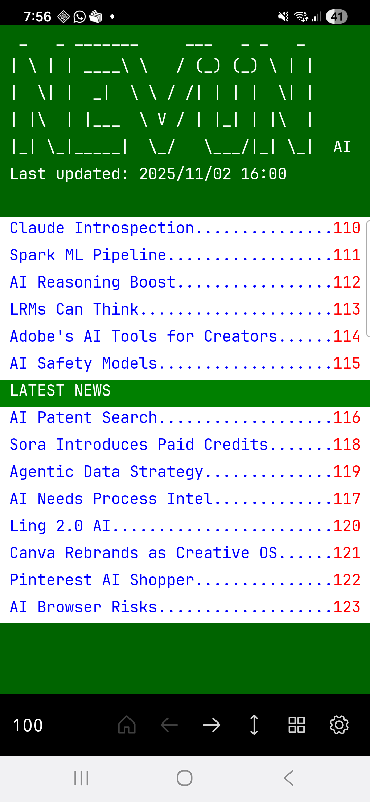
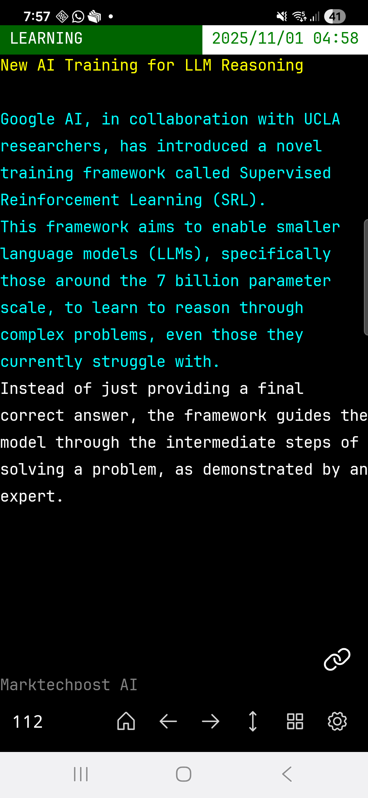
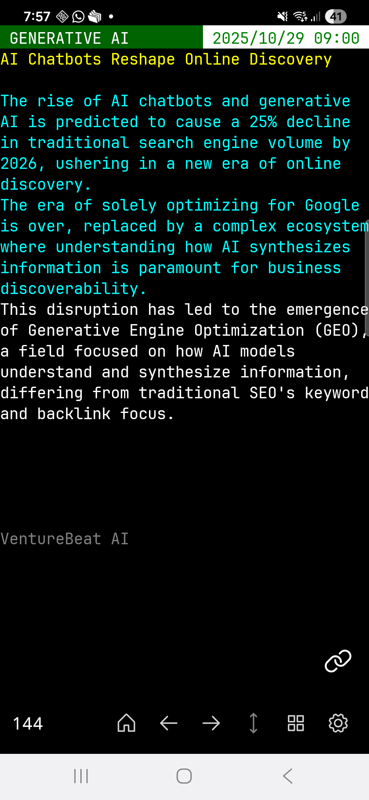
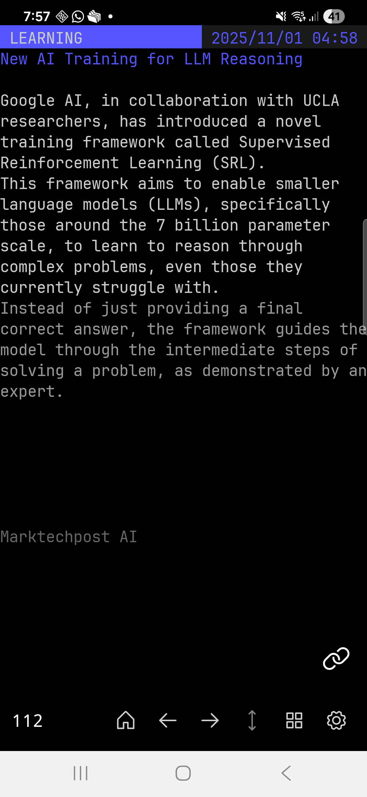

# Nüven - AI News in Teletext Format

<div align="center">
  
  <p><em>Main interface showing AI news in teletext format</em></p>
</div>

Nüven is an Android application that delivers AI news in a short, concise format inspired by Swiss teletext aesthetics. The app presents curated artificial intelligence news and developments through a nostalgic teletext interface, making complex AI topics accessible at a glance.

**Note**: This is the frontend application that consumes JSON data produced by a separate .NET backend service (not included yet in this repository).

The articles are sourced from several AI-related RSS feeds. You can find the full list under Settings → About in the app. Every 4 hours, a background job summarizes new content using the Gemini API. Each summary is then refined to fit the Teletext page format (maximum 40×25 characters). A JSON is then generated and pushed onto the Github repository where the frontend can download it.

## Vibe-Coding
This is a result of an attempt at testing the vibe-coding approach on a real application together with "context engineering" paradigm by feeding an agent with various .md files describing the specifications and the goals. The tools that have been used were Copilot CLI, Qwen CLI, Gemini CLI and also Opencode.

This was the first time I was working on a Kotlin app, 99% of the job was delegated to the AI.

## Screenshots

<div align="center">
  <table>
    <tr>
      <td align="center">
        
        <br/><em>Stretched mode</em>
      </td>
      <td align="center">
        
        <br/><em>Normal ratio mode</em>
      </td>
      <td align="center">
        
        <br/><em>Raven theme</em>
      </td>
    </tr>
  </table>
</div>

## Features

- **Swiss Teletext-Inspired Design**: Authentic rendering inspired by Swiss teletext aesthetics
- **Concise AI News**: Short, digestible summaries of AI developments and news
- **Multiple Themes**: Choose between classic teletext and modern Raven theme
- **Custom Fonts**: Support for VT323 and JetBrains Mono fonts
- **Flexible Viewing Modes**: Switch between normal ratio and stretched display modes
- **Page Navigation**: Navigate through pages using swipe gestures, keypad input, or navigation buttons
- **Background Updates**: Automatic content refresh using WorkManager
- **Customizable Toolbar**: Position toolbar at top or bottom
- **Deep Linking**: Support for direct page navigation via URLs
- **Settings Management**: Persistent user preferences with SharedPreferences

## Architecture

### Core Components

#### 1. **Teletext Parser & Renderer**
- **TeletextParser.kt**: Parses JSON-based article data and converts it into teletext format
- **PageFormatRenderer.kt**: Renders page format specifications with styled sections
- **PageTemplate.kt**: Provides templates for index pages, article pages, and navigation

#### 2. **Navigation System**
- **NavigationController.kt**: Manages page navigation history and state
- **ViewPager2**: Smooth horizontal swiping between pages
- **PageViewPagerAdapter**: Adapter managing page views with dynamic content loading

#### 3. **Theme System**
- **ThemeManager.kt**: Manages theme switching and color schemes
- **TeletextTheme.kt**: Classic teletext color palette
- **RavenTheme.kt**: Modern dark theme variant
- **ColorCodeMapper.kt**: Maps theme colors to ANSI-like color codes

#### 4. **Data Management**
- **DataManager.kt**: Handles data loading from JSON files (produced by backend service)
- **RefreshWorker.kt**: Background service for periodic content updates
- **SettingsManager.kt**: Centralized settings storage and retrieval

The application consumes JSON data formatted by a separate backend project responsible for aggregating and processing AI news.

#### 5. **UI Components**
- **MainActivity.kt**: Primary activity with ViewPager2 and navigation controls
- **SplashActivity.kt**: Launch screen with initialization
- **SettingsActivity.kt**: User preferences configuration
- **KeypadDialog.kt**: Custom keypad for direct page number input

### Page Format Structure

Pages are rendered using a flexible JSON-based format:

```kotlin
PageFormat {
  pageId: String
  title: String
  version: String
  globalStyles: {
    defaultForeground: String
    defaultBackground: String
    defaultFont: String
    maxPageWidth: Int
    maxPageHeight: Int
  }
  sections: [
    {
      type: "header" | "status" | "text-block"
      position: { row, column }
      styles: { foreground, background, font, etc. }
      content: { text, formatting }
    }
  ]
  links: [ { sourceRegion, targetPageId } ]
  metadata: { category, tags, lastUpdated }
}
```

## Technical Stack

- **Language**: Kotlin
- **Minimum SDK**: Android 7.0 (API 24)
- **Target SDK**: Android 14 (API 34)
- **Build System**: Gradle 8.7.3
- **Architecture Components**: 
  - ViewModel & LiveData for reactive UI
  - ViewPager2 for page navigation
  - WorkManager for background tasks
  - ConstraintLayout for responsive layouts

### Key Dependencies

```gradle
androidx.viewpager2:viewpager2:1.1.0
androidx.lifecycle:lifecycle-viewmodel-ktx:2.8.0
androidx.work:work-runtime-ktx:2.9.0
kotlinx-serialization-json:1.6.3
material:1.12.0
```

## Building & Running

### Prerequisites

- Android Studio Hedgehog (2023.1.1) or later
- JDK 17 or higher
- Android SDK with API 34 installed
- Git

### Clone the Repository

```bash
git clone https://github.com/kdrapel/nuven.git
cd nuven/frontend
```

### Build Instructions

#### Using Android Studio

1. Open Android Studio
2. Select `File > Open` and navigate to the `frontend` directory
3. Wait for Gradle sync to complete
4. Click `Run > Run 'app'` or press `Shift + F10`

#### Using Command Line

```bash
# For Windows
gradlew.bat assembleDebug

# For Linux/Mac
./gradlew assembleDebug
```

The APK will be generated at:
```
app/build/outputs/apk/debug/app-debug.apk
```

### Running on Device/Emulator

#### Physical Device
1. Enable Developer Options and USB Debugging on your Android device
2. Connect via USB
3. Run: `gradlew.bat installDebug` (Windows) or `./gradlew installDebug` (Linux/Mac)

#### Emulator
1. Create an AVD in Android Studio (API 24 or higher)
2. Start the emulator
3. Run: `gradlew.bat installDebug`

## Customization

### Adding New Themes

1. Create a new theme class implementing `TeletextTheme`:

```kotlin
class MyCustomTheme : TeletextTheme {
    override val black = Color.parseColor("#000000")
    override val red = Color.parseColor("#FF0000")
    // ... define other colors
}
```

2. Register in `ThemeManager.kt`:

```kotlin
fun getTheme(name: String): TeletextTheme {
    return when(name) {
        "custom" -> MyCustomTheme()
        // ... other themes
    }
}
```

### Adding New Fonts

1. Place TTF font file in `app/src/main/res/font/`
2. Register in `FontManager.kt`:

```kotlin
fun getTypeface(fontName: String): Typeface {
    return when(fontName) {
        "myfont" -> resources.getFont(R.font.my_font)
        // ... other fonts
    }
}
```

## Configuration

### Settings

Users can customize:
- **Theme**: Classic Teletext or Raven
- **Font**: VT323 (classic) or JetBrains Mono (modern)
- **Toolbar Position**: Top or Bottom
- **Display Mode**: Normal ratio or Stretched

Settings are persisted using SharedPreferences and accessible via the gear icon.

## 🔄 Data Flow

```
JSON Content (local/remote)
    ↓
TeletextParser
    ↓
PageTemplate / PageFormat
    ↓
PageFormatRenderer
    ↓
Styled SpannableString
    ↓
TextView (rendered page)
```

## Testing

Run unit tests:
```bash
gradlew.bat test
```

Run instrumented tests:
```bash
gradlew.bat connectedAndroidTest
```

## Data Source

This frontend application consumes JSON data produced by a separate backend service (not included in this repository). The backend is responsible for:
- Aggregating AI news from various sources
- Processing and summarizing content into concise formats
- Generating structured JSON for the frontend to consume

## Known Issues

- Background refresh requires network permission
- Some special characters may not render correctly in all fonts

---

<div align="center">
  Made with ❤️ for AI enthusiasts and Swiss teletext fans
</div>
